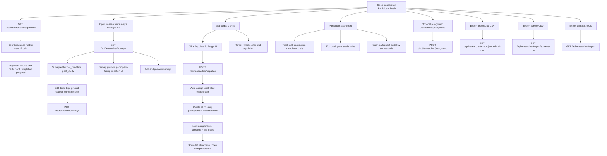

```mermaid
flowchart TD
    A[Open /researcher Participant Dash] --> B[GET /api/researcher/assignments]
    A --> C[Open /researcher/surveys Survey Area]
    C --> C1[GET /api/researcher/surveys]

    B --> D[Counterbalance matrix view 12 cells]
    D --> E[Inspect fill counts and participant completion progress]

    A --> R1[Set target N once]
    R1 --> R2[Click Populate To Target N]
    R2 --> R3[POST /api/researcher/populate]
    R3 --> R4[Auto-assign least-filled eligible cells]
    R4 --> R5[Create all missing participants + access codes]
    R5 --> R6[Insert assignments + sessions + trial plans]
    R6 --> R7[Share /study access codes with participants]
    R1 --> R8[Target N locks after first population]

    A --> M1[Participant dashboard]
    M1 --> M2[Track cell, completion, completed trials]
    M1 --> M3[Edit participant labels inline]
    M1 --> M4[Open participant portal by access code]

    C1 --> S1[Survey editor per_condition + post_study]
    S1 --> S2[Edit items type prompt required condition logic]
    S2 --> S3[PUT /api/researcher/surveys]
    C1 --> S4[Survey preview participant-facing question UI]
    C1 --> S5[Edit and preview surveys]

    A --> P1[Optional playground /researcher/playground]
    P1 --> P2[POST /api/researcher/playground]

    A --> X1[Export procedural CSV]
    A --> X1b[Export survey CSV]
    A --> X2[Export all data JSON]
    X1 --> X3[GET /api/researcher/export/procedural-csv]
    X1b --> X4[GET /api/researcher/export/surveys-csv]
    X2 --> X5[GET /api/researcher/export]
```
