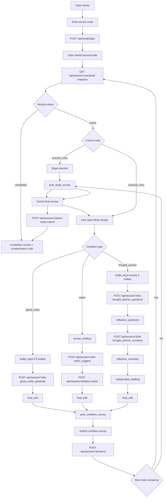

```mermaid
flowchart TD
    A[Open /study] --> B[Enter access code]
    B --> C[POST /api/study/login]
    C --> D[Open /study/:accessCode]
    D --> E[GET /api/session/:sessionId snapshot]

    E --> F{Session status}
    F -->|completed| Z[Completion screen + compensation code]
    F -->|active| G{Current state}

    G -->|practice_intro| P0[Begin practice]
    P0 --> P1[practice_task no AI]
    P1 --> P2[practice_survey]
    P2 --> H

    G -->|scenario_intro| H[Click Start When Ready]
    H --> I{Condition type}

    I -->|ghost_writer| GW1[bullet_input 3-5 bullets]
    GW1 --> GW2[POST /api/session/:id/ai ghost_writer_generate]
    GW2 --> GW3[final_edit]

    I -->|editor| E1[human_drafting]
    E1 --> E2[POST /api/session/:id/ai editor_suggest]
    E2 --> E3[POST /api/session/:id/editor-action]
    E3 --> E4[final_edit]

    I -->|thought_partner| TP1[bullet_input exactly 3 bullets]
    TP1 --> TP2[POST /api/session/:id/ai thought_partner_questions]
    TP2 --> TP3[reflection_questions]
    TP3 --> TP4[POST /api/session/:id/ai thought_partner_summary]
    TP4 --> TP5[reflection_summary]
    TP5 --> TP6[independent_drafting]
    TP6 --> TP7[final_edit]

    GW3 --> S1[post_condition_survey]
    E4 --> S1
    TP7 --> S1

    S1 --> S2[Submit condition survey]
    S2 --> S3[POST /api/session/:id/submit]
    S3 --> S4{More trials remaining}
    S4 -->|Yes| E
    S4 -->|No| P1[post_study_survey]

    P1 --> P2[Submit final survey]
    P2 --> P3[POST /api/session/:id/post-study-submit]
    P3 --> Z
```
